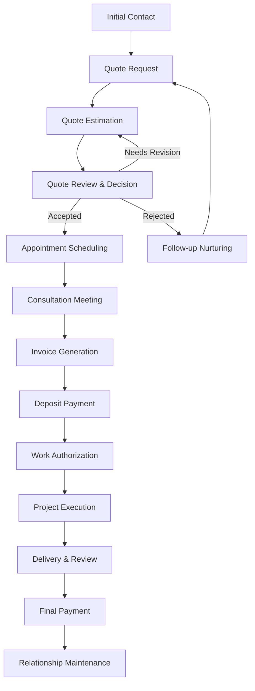

# Customer Lifecycle Management

**Complete conversion workflow for Lifestream Dynamics premium IT consultancy services**

This document outlines the comprehensive customer journey from initial inquiry through project completion, defining the processes, responsibilities, and automation points that ensure exceptional service delivery and business efficiency.

---

## 🎯 Lifecycle Overview

### Conversion Pipeline
The Lifestream Dynamics customer lifecycle follows a structured approach designed to qualify prospects, deliver value efficiently, and maintain long-term relationships:

---

## 📋 Stage 1: Request Quote
*Initial customer engagement and requirement gathering*

### Customer Actions
- **Website Form Submission** - Complete quote request form with project details
- **Service Selection** - Choose from tiered service offerings
- **File Attachments** - Upload relevant documents, screenshots, or specifications
- **Contact Preference** - Select preferred communication method

### System Actions (Automated)
- **Quote Number Generation** - Unique identifier (QR-YYYY-XXXX format)
- **Admin Notification** - Immediate email alert to service team
- **Customer Confirmation** - Automated acknowledgment with quote number and timeline
- **CRM Record Creation** - Customer profile and quote record established

### Business Rules
- **Response Time Commitment** - Initial response within 2-4 hours during business hours
- **Information Completeness** - All required fields must be completed
- **Service Categorization** - Automatic routing based on service type and complexity
- **Priority Classification** - Urgent requests flagged for immediate attention

### Admin Responsibilities
- **Quote Review** - Assess technical requirements and scope
- **Complexity Analysis** - Determine resource requirements and timeline
- **Risk Assessment** - Identify potential challenges or dependencies
- **Initial Research** - Gather additional information if needed

---

## 💰 Stage 2: Quote Estimation
*Professional assessment and pricing development*

### Admin Actions
- **Technical Analysis** - Detailed review of requirements and feasibility
- **Resource Planning** - Determine team members and time allocation
- **Pricing Calculation** - Apply service rates and complexity factors
- **Timeline Development** - Create realistic project schedule
- **Risk Mitigation** - Identify and plan for potential issues

### Quote Components
- **Executive Summary** - Clear description of proposed solution
- **Scope of Work** - Detailed breakdown of deliverables and activities
- **Timeline & Milestones** - Project phases with completion dates
- **Investment Details** - Pricing breakdown with deposit requirements
- **Terms & Conditions** - Service agreement and payment terms
- **Validity Period** - Quote expiration date (typically 30 days)

### System Support
- **Quote Template Engine** - Standardized formatting and branding
- **Pricing Calculator** - Automated rate calculations based on service type
- **Document Generation** - PDF quote creation with digital signatures
- **Email Delivery** - Professional quote delivery with tracking
- **Follow-up Automation** - Scheduled reminder emails

### Quality Assurance
- **Peer Review** - Secondary review for complex or high-value quotes
- **Accuracy Verification** - Double-check calculations and technical details
- **Brand Consistency** - Ensure professional presentation standards
- **Legal Compliance** - Verify terms and conditions are current

---

## ✅ Stage 3: Quote Accepted
*Customer approval and project initiation preparation*

### Customer Actions
- **Quote Acceptance** - Digital signature or email confirmation
- **Deposit Authorization** - Agreement to payment terms
- **Contact Confirmation** - Verify contact information and preferences
- **Additional Information** - Provide any supplementary details

### System Triggers (Automated)
- **Status Update** - Quote marked as "Accepted" in CRM
- **Admin Notification** - Immediate alert to project team
- **Calendar Integration** - Available appointment slots generated
- **Invoice Preparation** - Deposit invoice created in draft status
- **Project Setup** - Initial project record and documentation created

### Business Process
- **Stakeholder Notification** - All relevant team members informed
- **Resource Allocation** - Team members assigned and scheduled
- **Tool Preparation** - Access credentials and environments set up
- **Communication Plan** - Primary contacts and escalation paths established

---

## 📅 Stage 4: Appointment Workflow
*Automated scheduling and consultation preparation*

### Google Calendar Integration
- **Availability Sync** - Real-time calendar availability from admin calendars
- **15-Minute Slots** - Standard consultation windows with buffer time
- **Automated Booking** - Customer self-service appointment selection
- **Meeting Generation** - Zoom/Teams/Google Meet links created automatically
- **Reminder System** - Email and SMS reminders 24 hours and 1 hour before meeting

### Meeting Preparation
- **Customer Briefing** - Pre-meeting information packet sent to customer
- **Technical Setup** - Screen sharing tools and remote access prepared
- **Project Documentation** - Quote details and technical requirements reviewed
- **Team Coordination** - Ensure primary and backup team members are available

### Appointment Types
- **Discovery Consultation** - Initial project planning and requirement validation
- **Technical Assessment** - System analysis and compatibility review
- **Project Kickoff** - Work initiation and milestone planning
- **Status Review** - Progress updates and next steps discussion

### Backup Procedures
- **Rescheduling Options** - Easy calendar modification for customers
- **Emergency Contacts** - Alternative communication methods for urgent issues
- **Technical Difficulties** - Backup meeting platforms and phone support
- **Time Zone Management** - Automatic conversion for remote customers

---

## 🧾 Stage 5: Invoice Generated
*Detailed billing with deposit requirements*

### Invoice Components
- **Professional Header** - Company branding and contact information
- **Customer Information** - Billing details and project reference
- **Service Description** - Detailed breakdown of work to be performed
- **Payment Terms** - Deposit amount, due dates, and payment methods
- **Project Timeline** - Expected start date and completion milestones
- **Payment Instructions** - Clear guidance for all accepted payment methods

### System Features
- **Automated Generation** - Invoice created from accepted quote details
- **PDF Creation** - Professional document formatting with company branding
- **Email Delivery** - Secure delivery with read receipt confirmation
- **Payment Portal Link** - Direct access to online payment processing
- **Mobile Optimization** - Invoice viewing and payment on mobile devices

### Payment Methods Supported
- **Credit Card Processing** - Stripe integration with secure tokenization
- **Interac e-Transfer** - Email instructions and reference numbers
- **Cash Payments** - In-person or arranged pickup (local customers only)
- **Bank Transfer** - Wire transfer details for enterprise customers

### Deposit Requirements
- **Personal Services** - 25% deposit for most projects
- **Small Business** - 50% deposit for development projects
- **Enterprise** - 25-50% deposit based on project scope and customer history
- **Emergency Services** - 100% payment due within 48 hours

---

## 💳 Stage 6: Deposit Paid
*Payment processing and work authorization*

### Payment Processing
- **Automatic Verification** - Real-time payment confirmation via Stripe webhooks
- **Manual Confirmation** - Admin verification for e-transfer and cash payments
- **Receipt Generation** - Automatic receipt creation and email delivery
- **Balance Update** - Invoice status and remaining balance calculated
- **CRM Integration** - Customer payment history updated

### Work Authorization Triggers
- **Project Activation** - Status changed to "Active" in project management system
- **Team Notification** - All team members notified that work can commence
- **Resource Allocation** - Tools, accounts, and access credentials prepared
- **Timeline Activation** - Project milestones and deadlines activated
- **Communication Initiation** - Customer onboarding and regular update schedule

### Quality Controls
- **Payment Validation** - Verify payment amount matches deposit requirement
- **Customer Verification** - Confirm payment source matches customer record
- **Fraud Protection** - Review for suspicious payment patterns
- **Documentation** - All payment details recorded for audit trail

---

## 🚀 Stage 7: Work Begins & Project Initiated
*Project execution and delivery management*

### Project Kickoff
- **Kick-off Meeting** - Project goals, timeline, and communication plan
- **Access Provisioning** - Customer system access and credentials
- **Team Introduction** - Primary contacts and escalation procedures
- **Documentation Setup** - Shared project folders and collaboration tools
- **Progress Tracking** - Milestone tracking and reporting system activation

### Communication Protocol
- **Daily Updates** - Progress reports for active development projects
- **Weekly Summaries** - Comprehensive status reports with metrics
- **Issue Escalation** - Clear procedures for problem resolution
- **Change Management** - Process for scope modifications and approvals
- **Customer Feedback** - Regular satisfaction checks and adjustment opportunities

### Project Management
- **Task Tracking** - Detailed work breakdown and completion monitoring
- **Time Logging** - Accurate time tracking for billing and analysis
- **Quality Assurance** - Regular testing and validation procedures
- **Risk Monitoring** - Proactive identification and mitigation of issues
- **Milestone Validation** - Customer approval of completed phases

### Deliverable Management
- **Version Control** - Systematic tracking of all work products
- **Testing Protocols** - Quality assurance before customer presentation
- **Documentation Standards** - Comprehensive technical documentation
- **Customer Training** - Knowledge transfer and capability building
- **Warranty Coverage** - 30-day warranty on all development work

---

## 🎯 Stage 8: Project Completion
*Final delivery and customer satisfaction*

### Completion Criteria
- **Deliverable Acceptance** - Customer sign-off on all project components
- **Quality Validation** - All testing and quality checks completed
- **Documentation Delivery** - Technical documentation and user guides provided
- **Knowledge Transfer** - Customer team training and capability transfer
- **Warranty Activation** - 30-day support period initiated

### Final Invoice Processing
- **Balance Calculation** - Remaining payment amount calculated
- **Time Reconciliation** - Actual vs. estimated time analysis
- **Change Order Integration** - Any approved scope changes included
- **Final Invoice Generation** - Professional invoice with project summary
- **Payment Processing** - Same payment options as deposit

### Customer Satisfaction
- **Satisfaction Survey** - Detailed feedback collection
- **Success Metrics Review** - Measurement against project objectives
- **Lessons Learned** - Process improvement opportunities
- **Case Study Development** - Success story documentation (with permission)
- **Reference Request** - Permission to use as customer reference

---

## 🔄 Stage 9: Relationship Maintenance
*Long-term customer relationship and repeat business*

### Ongoing Support
- **Warranty Period** - 30-day comprehensive support
- **Technical Support** - Ongoing assistance as needed
- **System Monitoring** - Proactive monitoring where applicable
- **Upgrade Opportunities** - Recommendations for enhancements
- **Emergency Support** - Priority access to urgent assistance

### Business Development
- **Periodic Check-ins** - Quarterly relationship management calls
- **New Opportunity Identification** - Additional service recommendations
- **Referral Program** - Incentives for customer referrals
- **Case Study Development** - Success story creation and promotion
- **Testimonial Collection** - Customer success story documentation

### Customer Retention
- **Satisfaction Monitoring** - Regular relationship health checks
- **Service Improvement** - Continuous enhancement based on feedback
- **Loyalty Programs** - Repeat customer benefits and discounts
- **Exclusive Access** - Early access to new services and capabilities
- **Community Building** - Customer networking and knowledge sharing

---

## 🔄 Exception Handling & Recovery

### Quote Rejection Management
- **Rejection Analysis** - Understanding reasons for non-acceptance
- **Competitive Analysis** - Market positioning and pricing review
- **Follow-up Strategy** - Nurturing sequence for future opportunities
- **Referral Opportunities** - Alternative service providers if appropriate

### Payment Issues
- **Payment Failure Recovery** - Automated retry and customer notification
- **Extended Payment Terms** - Flexibility for exceptional circumstances
- **Collection Procedures** - Systematic approach for overdue accounts
- **Service Suspension** - Clear policies for non-payment situations

### Project Challenges
- **Scope Creep Management** - Change order processes and approvals
- **Timeline Extensions** - Customer communication and expectation management
- **Quality Issues** - Remediation processes and customer satisfaction
- **Team Changes** - Continuity planning and knowledge transfer

### Customer Escalation
- **Issue Resolution Process** - Clear escalation paths and timeframes
- **Management Involvement** - Executive engagement for critical issues
- **Service Recovery** - Making things right when problems occur
- **Process Improvement** - Learning from issues to prevent recurrence

---

## 📊 Key Performance Indicators

### Conversion Metrics
- **Quote-to-Customer Conversion Rate** - Target: 40% overall
- **Time to Quote** - Target: 4 hours average response time
- **Quote Accuracy** - Target: 95% of projects delivered within 10% of quote
- **Customer Satisfaction** - Target: 90% satisfaction rating

### Business Metrics
- **Average Project Value** - Track growth in project size and scope
- **Customer Lifetime Value** - Measure long-term relationship value
- **Repeat Business Rate** - Target: 60% of customers engage for additional projects
- **Referral Rate** - Target: 30% of new customers from referrals

### Operational Metrics
- **Project Delivery Time** - On-time delivery rate target: 95%
- **Payment Collection Time** - Average days to payment
- **Support Request Volume** - Post-project support requirements
- **Team Utilization** - Resource planning and capacity optimization

---

## 🛠 System Integration Points

### CRM Integration
- **Customer Data Sync** - Real-time updates across all systems
- **Activity Tracking** - Comprehensive customer interaction history
- **Pipeline Management** - Visual representation of all opportunities
- **Automated Workflows** - Trigger-based actions and notifications

### Calendar Integration
- **Google Calendar API** - Automated scheduling and availability management
- **Meeting Platform Integration** - Zoom, Teams, and Google Meet connectivity
- **Reminder Systems** - Multi-channel notification delivery
- **Time Zone Handling** - Automatic conversion for global customers

### Payment Integration
- **Stripe Webhooks** - Real-time payment processing and confirmation
- **Invoice Generation** - Automated billing and payment tracking
- **Receipt Management** - Automatic receipt generation and delivery
- **Financial Reporting** - Integration with accounting and reporting systems

### Communication Integration
- **Email Automation** - Template-based customer communications
- **SMS Notifications** - Critical updates and appointment reminders
- **Document Generation** - Automated quote, invoice, and contract creation
- **Knowledge Base** - Customer self-service and support documentation

---

**Document Version:** 1.0
**Last Updated:** 2025-09-26
**Next Review:** 2025-12-26
**Process Owner:** Operations Team