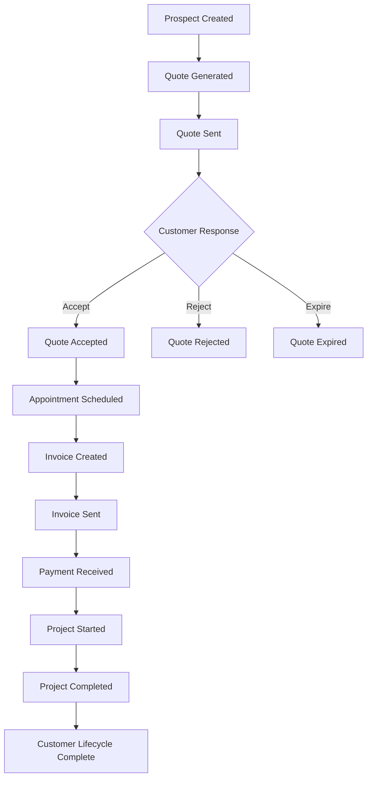

# 🤖 AI Agent Reference Documentation

> **Comprehensive reference for AI agents building frontend applications and integrations with the Enterprise Accounting API**

## 📋 Table of Contents

- [API Schema Overview](#api-schema-overview)
- [Data Models & Relationships](#data-models--relationships)
- [Business Logic Flows](#business-logic-flows)
- [Frontend Development Guidelines](#frontend-development-guidelines)
- [Component Architecture](#component-architecture)
- [State Management Patterns](#state-management-patterns)
- [Real-time Features](#real-time-features)
- [Common UI Patterns](#common-ui-patterns)

---

## 🗂️ API Schema Overview

### Core Entity Structure

The API follows a hierarchical multi-tenant structure:

```
Organization (Root)
├── Users (Authentication & RBAC)
├── Customers (Person | Business)
├── Financial Entities
│   ├── Quotes → Invoices → Payments
│   ├── Projects → Appointments
│   └── Accounts → Transactions
└── Reference Data
    ├── Products & Services
    ├── Addresses & Locations
    └── Audit Logs
```

### Data Hierarchy Relationships

```typescript
// Primary relationships AI agents should understand
interface EntityRelationships {
  organization: {
    hasMany: ['users', 'customers', 'quotes', 'invoices', 'payments', 'projects'];
    isolation: 'complete'; // Each org's data is completely separate
  };

  customer: {
    hasMany: ['quotes', 'invoices', 'payments', 'projects', 'appointments'];
    belongsTo: ['organization'];
    polymorphic: 'person | business'; // Can be either individual or business
  };

  quote: {
    hasMany: ['quoteItems'];
    belongsTo: ['organization', 'customer', 'createdBy'];
    convertsTo: 'invoice'; // Business flow: quote → invoice
  };

  invoice: {
    hasMany: ['invoiceItems', 'payments'];
    belongsTo: ['organization', 'customer'];
    belongsToOptional: ['quote']; // Can be created from quote or standalone
  };

  payment: {
    belongsTo: ['organization', 'customer'];
    belongsToOptional: ['invoice']; // Can be unallocated
    types: ['STRIPE_CARD', 'ETRANSFER', 'CASH', 'CHEQUE', 'BANK_TRANSFER'];
  };
}
```

### API Endpoint Patterns

All endpoints follow consistent patterns:

```typescript
interface APIPatterns {
  // Standard CRUD operations
  list: 'GET /api/v1/{resource}?page=1&limit=50&filter=value';
  create: 'POST /api/v1/{resource}';
  read: 'GET /api/v1/{resource}/{id}';
  update: 'PUT /api/v1/{resource}/{id}';
  delete: 'DELETE /api/v1/{resource}/{id}';

  // Business operations
  actions: 'POST /api/v1/{resource}/{id}/{action}'; // e.g., /quotes/123/send

  // Nested resources
  nested: 'GET /api/v1/{parent}/{id}/{child}'; // e.g., /customers/123/quotes

  // Analytics and reporting
  analytics: 'GET /api/v1/{resource}-analytics/{report-type}';
}
```

---

## 📊 Data Models & Relationships

### Core Data Models

#### Customer Model
```typescript
interface Customer {
  id: string;
  organizationId: string;
  customerNumber: string; // Auto-generated, unique per org

  // Polymorphic - can be Person OR Business
  person?: {
    firstName: string;
    lastName: string;
    email?: string;
    phone?: string;
    dateOfBirth?: string;
  };

  business?: {
    legalName: string;
    tradeName?: string;
    businessNumber?: string;
    email?: string;
    phone?: string;
  };

  // Customer-specific fields
  tier: 'PERSONAL' | 'BUSINESS' | 'ENTERPRISE';
  status: 'PROSPECT' | 'ACTIVE' | 'INACTIVE' | 'ARCHIVED';
  creditLimit?: number;
  paymentTerms: number; // Days
  preferredCurrency: string;

  // Relationships
  addresses: CustomerAddress[];
  quotes: Quote[];
  invoices: Invoice[];
  payments: Payment[];
  projects: Project[];

  // Metadata
  createdAt: string;
  updatedAt: string;
}
```

#### Quote-to-Invoice Lifecycle
```typescript
interface Quote {
  id: string;
  quoteNumber: string; // QUO-2024-001
  customerId: string;

  status: 'DRAFT' | 'SENT' | 'ACCEPTED' | 'REJECTED' | 'EXPIRED';
  validUntil: string; // ISO date

  // Financial calculations
  subtotal: number;    // Sum of all items before tax
  taxAmount: number;   // Total tax
  total: number;       // Final amount

  items: QuoteItem[];

  // Tracking
  sentAt?: string;
  viewedAt?: string;
  acceptedAt?: string;

  // Conversion
  invoice?: Invoice; // One-to-one when converted
}

interface Invoice {
  id: string;
  invoiceNumber: string; // INV-2024-001
  customerId: string;
  quoteId?: string; // If created from quote

  status: 'DRAFT' | 'SENT' | 'PARTIAL' | 'PAID' | 'OVERDUE' | 'CANCELLED';
  issueDate: string;
  dueDate: string;

  // Financial tracking
  subtotal: number;
  taxAmount: number;
  total: number;
  amountPaid: number;  // Sum of all payments
  balance: number;     // total - amountPaid

  items: InvoiceItem[];
  payments: Payment[];
}
```

#### Payment Processing
```typescript
interface Payment {
  id: string;
  paymentNumber: string; // PAY-2024-001
  customerId: string;
  invoiceId?: string; // Can be unallocated

  paymentMethod: 'STRIPE_CARD' | 'ETRANSFER' | 'CASH' | 'CHEQUE' | 'BANK_TRANSFER';
  amount: number;
  currency: string;
  paymentDate: string;

  status: 'PENDING' | 'PROCESSING' | 'COMPLETED' | 'FAILED' | 'CANCELLED';

  // Method-specific fields
  stripePaymentIntentId?: string; // For Stripe payments
  referenceNumber?: string; // For e-transfers, cheques, etc.

  // Fees and net amounts
  processorFee?: number;
  netAmount?: number;

  // Admin tracking
  adminNotes?: string;
  metadata?: Record<string, any>;
}
```

### Polymorphic Relationships

The system uses polymorphic relationships for flexibility:

```typescript
// Customer can be either Person or Business
interface CustomerPolymorphism {
  // Person customer
  personCustomer: {
    personId: string;
    businessId: null;
    displayName: 'firstName lastName';
    primaryContact: 'self';
  };

  // Business customer
  businessCustomer: {
    personId: null;
    businessId: string;
    displayName: 'business.legalName';
    primaryContact: 'business.email';
  };
}

// AI agents should handle both cases:
function getCustomerDisplayName(customer: Customer): string {
  if (customer.person) {
    return `${customer.person.firstName} ${customer.person.lastName}`;
  } else if (customer.business) {
    return customer.business.legalName;
  }
  return 'Unknown Customer';
}
```

### Reference Data Structure

```typescript
interface ReferenceData {
  // Countries and addresses
  countries: Country[];

  // Product and service catalogs
  productCategories: ProductCategory[];
  serviceCategories: ServiceCategory[];
  products: Product[];
  services: Service[];

  // Financial
  currencies: Currency[];
  taxRates: TaxRate[];

  // Chart of accounts
  accounts: Account[];
}

// These should be cached by AI agents for offline use
```

---

## 🔄 Business Logic Flows

### Complete Customer Lifecycle



### State Transitions

#### Quote States
```typescript
interface QuoteStateTransitions {
  DRAFT: ['SENT', 'DELETED'];
  SENT: ['ACCEPTED', 'REJECTED', 'EXPIRED'];
  ACCEPTED: ['CONVERTED_TO_INVOICE']; // Business rule
  REJECTED: []; // Terminal state
  EXPIRED: ['RESENT']; // Can create new quote
}

// AI agents should validate state transitions
function canTransitionQuote(currentStatus: string, newStatus: string): boolean {
  const allowedTransitions = QuoteStateTransitions[currentStatus] || [];
  return allowedTransitions.includes(newStatus);
}
```

#### Invoice States
```typescript
interface InvoiceStateTransitions {
  DRAFT: ['SENT', 'DELETED'];
  SENT: ['PARTIAL', 'PAID', 'OVERDUE', 'CANCELLED'];
  PARTIAL: ['PAID', 'OVERDUE', 'CANCELLED'];
  PAID: []; // Terminal state
  OVERDUE: ['PAID', 'PARTIAL', 'CANCELLED'];
  CANCELLED: []; // Terminal state
}

// Automatic transitions based on business rules
interface AutoTransitions {
  invoice: {
    // When payment received
    onPayment: 'balance === 0 ? PAID : PARTIAL';

    // When due date passes
    onDueDatePassed: 'balance > 0 ? OVERDUE : current_status';
  };
}
```

### Financial Calculations

```typescript
// Line item calculations (for quotes and invoices)
interface LineItemCalculation {
  quantity: number;
  unitPrice: number;
  discountPercent: number;
  taxRate: number;

  // Calculated fields
  subtotal: quantity * unitPrice;
  discountAmount: subtotal * (discountPercent / 100);
  discountedAmount: subtotal - discountAmount;
  taxAmount: discountedAmount * taxRate;
  total: discountedAmount + taxAmount;
}

// Document totals
interface DocumentTotals {
  subtotal: sum(items.subtotal);
  totalDiscount: sum(items.discountAmount);
  taxAmount: sum(items.taxAmount);
  total: sum(items.total);
}

// Payment allocation
interface PaymentAllocation {
  // When payment amount < invoice balance
  partial: {
    amountPaid: payment.amount;
    balance: invoice.total - amountPaid;
    status: 'PARTIAL';
  };

  // When payment amount >= invoice balance
  full: {
    amountPaid: invoice.total;
    balance: 0;
    status: 'PAID';
    overpayment: payment.amount - invoice.total;
  };
}
```

### Business Rules Engine

```typescript
interface BusinessRules {
  // Customer creation rules
  customer: {
    emailRequired: boolean;
    phoneRequired: boolean;
    uniqueEmailPerOrg: boolean;
    autoGenerateCustomerNumber: boolean;
  };

  // Quote rules
  quote: {
    validUntilMinDays: number;
    validUntilMaxDays: number;
    autoExpiry: boolean;
    requireCustomerApproval: boolean;
  };

  // Invoice rules
  invoice: {
    defaultPaymentTerms: number; // Days
    overdueGracePeriod: number; // Days
    autoSendReminders: boolean;
    allowPartialPayments: boolean;
  };

  // Payment rules
  payment: {
    allowOverpayment: boolean;
    autoAllocateToOldestInvoice: boolean;
    requireApprovalAbove: number; // Amount
  };
}

// AI agents should validate against these rules
function validateQuoteCreation(quote: Partial<Quote>): ValidationResult {
  const errors: string[] = [];

  if (!quote.customerId) {
    errors.push('Customer is required');
  }

  if (quote.validUntil) {
    const validUntil = new Date(quote.validUntil);
    const minDate = addDays(new Date(), BusinessRules.quote.validUntilMinDays);
    const maxDate = addDays(new Date(), BusinessRules.quote.validUntilMaxDays);

    if (validUntil < minDate || validUntil > maxDate) {
      errors.push(`Valid until must be between ${minDate} and ${maxDate}`);
    }
  }

  return {
    isValid: errors.length === 0,
    errors
  };
}
```

---

## 🎨 Frontend Development Guidelines

### Component Hierarchy

```typescript
// Recommended component structure for AI agents
interface ComponentStructure {
  // Layout components
  AppLayout: {
    Navigation: ['Sidebar', 'TopBar', 'UserMenu'];
    Content: ['MainContent', 'PageHeader', 'Breadcrumbs'];
    Modals: ['ConfirmDialog', 'NotificationToast'];
  };

  // Feature components
  CustomerManagement: {
    CustomerList: ['CustomerCard', 'CustomerFilters', 'Pagination'];
    CustomerDetail: ['CustomerProfile', 'CustomerQuotes', 'CustomerInvoices'];
    CustomerForm: ['PersonForm', 'BusinessForm', 'AddressForm'];
  };

  // Financial components
  QuoteManagement: {
    QuoteList: ['QuoteCard', 'QuoteFilters', 'StatusBadge'];
    QuoteDetail: ['QuoteHeader', 'QuoteItems', 'QuoteActions'];
    QuoteForm: ['QuoteItemForm', 'LineItemTable', 'TotalCalculator'];
  };

  // Shared components
  Common: {
    Forms: ['Input', 'Select', 'DatePicker', 'FileUpload'];
    Display: ['DataTable', 'StatusBadge', 'Avatar', 'Currency'];
    Feedback: ['LoadingSpinner', 'ErrorBoundary', 'EmptyState'];
  };
}
```

### Recommended Tech Stack

```typescript
interface RecommendedStack {
  // Frontend frameworks (choose one)
  frameworks: [
    'React + TypeScript',
    'Vue 3 + TypeScript',
    'Angular',
    'Svelte + TypeScript'
  ];

  // State management
  stateManagement: [
    'Redux Toolkit', // For React
    'Pinia',        // For Vue
    'NgRx',         // For Angular
    'Zustand'       // Lightweight option
  ];

  // UI component libraries
  uiLibraries: [
    'Material-UI',   // React
    'Ant Design',    // React/Vue
    'Chakra UI',     // React
    'Quasar',        // Vue
    'PrimeNG'        // Angular
  ];

  // API client
  apiClients: [
    'Axios',
    'React Query/TanStack Query',
    'SWR',
    'Apollo Client' // If GraphQL needed
  ];

  // Form handling
  formLibraries: [
    'React Hook Form', // React
    'Formik',          // React
    'VeeValidate',     // Vue
    'Angular Reactive Forms'
  ];
}
```

### API Integration Patterns

```typescript
// Recommended API service structure
class APIService {
  private client: AxiosInstance;

  constructor() {
    this.client = axios.create({
      baseURL: process.env.REACT_APP_API_URL,
      timeout: 30000
    });

    this.setupInterceptors();
  }

  // Customer services
  customers = {
    list: (params?: CustomerListParams) =>
      this.client.get('/api/v1/customers', { params }),

    get: (id: string) =>
      this.client.get(`/api/v1/customers/${id}`),

    create: (data: CreateCustomerRequest) =>
      this.client.post('/api/v1/customers', data),

    update: (id: string, data: UpdateCustomerRequest) =>
      this.client.put(`/api/v1/customers/${id}`, data),

    delete: (id: string) =>
      this.client.delete(`/api/v1/customers/${id}`)
  };

  // Quote services
  quotes = {
    list: (params?: QuoteListParams) =>
      this.client.get('/api/v1/quotes', { params }),

    create: (data: CreateQuoteRequest) =>
      this.client.post('/api/v1/quotes', data),

    send: (id: string) =>
      this.client.post(`/api/v1/quotes/${id}/send`),

    accept: (id: string) =>
      this.client.post(`/api/v1/quotes/${id}/accept`),

    convertToInvoice: (id: string) =>
      this.client.post(`/api/v1/quotes/${id}/convert-to-invoice`)
  };

  // Payment services
  payments = {
    process: (data: ProcessPaymentRequest) =>
      this.client.post('/api/v1/payments', data),

    createETransfer: (data: CreateETransferRequest) =>
      this.client.post('/api/v1/etransfers', data)
  };
}
```

### Error Handling Strategy

```typescript
// Global error handling for AI agents
interface ErrorHandlingStrategy {
  // API error interceptor
  apiErrorHandler: (error: AxiosError) => {
    const status = error.response?.status;
    const data = error.response?.data;

    switch (status) {
      case 401:
        // Redirect to login
        authService.logout();
        router.push('/login');
        break;

      case 403:
        // Show permission denied message
        showNotification('Access denied', 'error');
        break;

      case 422:
        // Handle validation errors
        handleValidationErrors(data.validationErrors);
        break;

      case 429:
        // Rate limit exceeded
        showNotification('Too many requests. Please try again later.', 'warning');
        break;

      default:
        // Generic error handling
        showNotification(data.error?.message || 'An error occurred', 'error');
    }
  };

  // Component error boundaries
  errorBoundary: {
    fallbackComponent: 'ErrorFallback';
    errorReporting: 'logErrorToService';
    recovery: 'reloadComponent';
  };
}

// React error boundary example
class ErrorBoundary extends React.Component {
  constructor(props) {
    super(props);
    this.state = { hasError: false, error: null };
  }

  static getDerivedStateFromError(error) {
    return { hasError: true, error };
  }

  componentDidCatch(error, errorInfo) {
    // Log error to monitoring service
    errorReportingService.logError(error, errorInfo);
  }

  render() {
    if (this.state.hasError) {
      return <ErrorFallback error={this.state.error} />;
    }

    return this.props.children;
  }
}
```

---

## 🏗️ Component Architecture

### Smart vs Presentational Components

```typescript
// Smart components (containers) - handle data and business logic
interface SmartComponent {
  responsibilities: [
    'API calls',
    'State management',
    'Business logic',
    'Data transformation'
  ];

  example: {
    name: 'CustomerListContainer';
    props: {
      // No props - gets data internally
    };
    state: {
      customers: Customer[];
      loading: boolean;
      error: string | null;
      filters: CustomerFilters;
      pagination: PaginationState;
    };
  };
}

// Presentational components - pure UI components
interface PresentationalComponent {
  responsibilities: [
    'Rendering UI',
    'User interactions',
    'Props handling',
    'Local UI state only'
  ];

  example: {
    name: 'CustomerCard';
    props: {
      customer: Customer;
      onEdit: (id: string) => void;
      onDelete: (id: string) => void;
      onViewDetails: (id: string) => void;
    };
    state: {
      // Only local UI state like hover, expanded, etc.
      isHovered: boolean;
      isExpanded: boolean;
    };
  };
}
```

### Component Composition Patterns

```typescript
// Compound components for complex UI
interface CompoundComponentPattern {
  // Main component
  CustomerForm: {
    // Sub-components
    Header: CustomerFormHeader;
    PersonalInfo: CustomerFormPersonalInfo;
    BusinessInfo: CustomerFormBusinessInfo;
    Address: CustomerFormAddress;
    Footer: CustomerFormFooter;

    // Composition
    usage: `
      <CustomerForm>
        <CustomerForm.Header title="New Customer" />
        <CustomerForm.PersonalInfo />
        <CustomerForm.BusinessInfo />
        <CustomerForm.Address />
        <CustomerForm.Footer />
      </CustomerForm>
    `;
  };
}

// Render props pattern for data sharing
interface RenderPropsPattern {
  DataProvider: {
    example: `
      <CustomerDataProvider customerId={id}>
        {({ customer, loading, error }) => (
          <div>
            {loading && <LoadingSpinner />}
            {error && <ErrorMessage error={error} />}
            {customer && <CustomerDetail customer={customer} />}
          </div>
        )}
      </CustomerDataProvider>
    `;
  };
}

// Custom hooks for logic reuse (React)
interface CustomHooksPattern {
  useCustomer: {
    signature: 'const { customer, loading, error, refetch } = useCustomer(id)';
    benefits: ['Reusable logic', 'Simplified components', 'Easy testing'];
  };

  useQuoteCalculations: {
    signature: 'const { subtotal, tax, total } = useQuoteCalculations(items)';
    benefits: ['Complex calculations', 'Real-time updates', 'Consistent logic'];
  };
}
```

### Recommended Component Library

```typescript
// Core UI components for accounting applications
interface AccountingUIComponents {
  // Data display
  CustomerCard: {
    props: {
      customer: Customer;
      showActions?: boolean;
      compact?: boolean;
    };
    features: ['Avatar', 'Status badge', 'Contact info', 'Quick actions'];
  };

  InvoiceTable: {
    props: {
      invoices: Invoice[];
      sortable?: boolean;
      filterable?: boolean;
      pagination?: PaginationProps;
    };
    features: ['Status indicators', 'Amount formatting', 'Due date highlighting'];
  };

  // Forms
  CustomerForm: {
    props: {
      initialData?: Partial<Customer>;
      onSubmit: (data: CustomerFormData) => void;
      mode: 'create' | 'edit';
    };
    features: ['Validation', 'Person/Business toggle', 'Address handling'];
  };

  QuoteItemForm: {
    props: {
      products: Product[];
      services: Service[];
      onItemAdd: (item: QuoteItem) => void;
    };
    features: ['Product/Service search', 'Real-time calculations', 'Tax handling'];
  };

  // Financial components
  CurrencyInput: {
    props: {
      value: number;
      currency: string;
      onChange: (amount: number) => void;
    };
    features: ['Localized formatting', 'Symbol display', 'Validation'];
  };

  PaymentForm: {
    props: {
      invoice?: Invoice;
      paymentMethods: PaymentMethod[];
      onSubmit: (payment: PaymentData) => void;
    };
    features: ['Method selection', 'Amount validation', 'Reference tracking'];
  };

  // Status components
  StatusBadge: {
    props: {
      status: string;
      type: 'customer' | 'quote' | 'invoice' | 'payment';
    };
    features: ['Color coding', 'Icon indicators', 'Tooltips'];
  };
}
```

---

## 🔄 State Management Patterns

### Redux Toolkit Structure (React)

```typescript
// Store structure for accounting app
interface StoreStructure {
  // Authentication
  auth: {
    user: User | null;
    token: string | null;
    isAuthenticated: boolean;
    loading: boolean;
  };

  // Organization context
  organization: {
    current: Organization | null;
    settings: OrganizationSettings;
    members: User[];
  };

  // Core entities
  customers: {
    entities: Record<string, Customer>;
    ids: string[];
    loading: boolean;
    error: string | null;
    filters: CustomerFilters;
    pagination: PaginationState;
  };

  quotes: {
    entities: Record<string, Quote>;
    ids: string[];
    loading: boolean;
    currentQuote: Quote | null;
  };

  invoices: {
    entities: Record<string, Invoice>;
    ids: string[];
    loading: boolean;
  };

  payments: {
    entities: Record<string, Payment>;
    ids: string[];
    processing: boolean;
  };

  // UI state
  ui: {
    sidebar: {
      isOpen: boolean;
      activeItem: string;
    };
    modals: {
      customerForm: boolean;
      paymentForm: boolean;
    };
    notifications: Notification[];
  };
}

// Redux slices
const customersSlice = createSlice({
  name: 'customers',
  initialState,
  reducers: {
    // Synchronous actions
    setFilters: (state, action) => {
      state.filters = action.payload;
    },

    clearError: (state) => {
      state.error = null;
    }
  },

  extraReducers: (builder) => {
    // Async actions
    builder
      .addCase(fetchCustomers.pending, (state) => {
        state.loading = true;
        state.error = null;
      })
      .addCase(fetchCustomers.fulfilled, (state, action) => {
        state.loading = false;
        customersAdapter.setAll(state, action.payload.customers);
        state.pagination = action.payload.pagination;
      })
      .addCase(fetchCustomers.rejected, (state, action) => {
        state.loading = false;
        state.error = action.error.message;
      });
  }
});

// Async thunks
export const fetchCustomers = createAsyncThunk(
  'customers/fetchCustomers',
  async (params: CustomerListParams, { getState, rejectWithValue }) => {
    try {
      const response = await apiService.customers.list(params);
      return response.data;
    } catch (error) {
      return rejectWithValue(error.response.data);
    }
  }
);
```

### Pinia Store Structure (Vue 3)

```typescript
// Customer store
export const useCustomerStore = defineStore('customers', () => {
  // State
  const customers = ref<Customer[]>([]);
  const currentCustomer = ref<Customer | null>(null);
  const loading = ref(false);
  const error = ref<string | null>(null);
  const filters = ref<CustomerFilters>({});

  // Getters
  const activeCustomers = computed(() =>
    customers.value.filter(c => c.status === 'ACTIVE')
  );

  const customerById = computed(() =>
    (id: string) => customers.value.find(c => c.id === id)
  );

  // Actions
  async function fetchCustomers(params?: CustomerListParams) {
    loading.value = true;
    error.value = null;

    try {
      const response = await apiService.customers.list(params);
      customers.value = response.data.customers;
    } catch (err) {
      error.value = err.message;
    } finally {
      loading.value = false;
    }
  }

  async function createCustomer(data: CreateCustomerRequest) {
    try {
      const response = await apiService.customers.create(data);
      customers.value.push(response.data);
      return response.data;
    } catch (err) {
      error.value = err.message;
      throw err;
    }
  }

  function setFilters(newFilters: CustomerFilters) {
    filters.value = { ...filters.value, ...newFilters };
  }

  function clearError() {
    error.value = null;
  }

  return {
    // State
    customers: readonly(customers),
    currentCustomer: readonly(currentCustomer),
    loading: readonly(loading),
    error: readonly(error),
    filters: readonly(filters),

    // Getters
    activeCustomers,
    customerById,

    // Actions
    fetchCustomers,
    createCustomer,
    setFilters,
    clearError
  };
});
```

### State Synchronization Patterns

```typescript
// Real-time updates via WebSocket
interface RealTimeSync {
  setup: {
    connection: 'WebSocket to wss://api.accounting.example.com/ws';
    authentication: 'JWT token in query params or headers';
    heartbeat: 'Ping/pong every 30 seconds';
  };

  eventHandling: {
    'customer.updated': (payload) => {
      // Update customer in store
      customerStore.updateCustomer(payload.data.object);
    };

    'quote.accepted': (payload) => {
      // Update quote status and show notification
      quoteStore.updateQuote(payload.data.object);
      notificationStore.addNotification({
        type: 'success',
        message: `Quote ${payload.data.object.quoteNumber} was accepted!`
      });
    };

    'payment.succeeded': (payload) => {
      // Update payment and related invoice
      paymentStore.addPayment(payload.data.object);
      if (payload.data.object.invoiceId) {
        invoiceStore.updateInvoiceBalance(payload.data.object.invoiceId);
      }
    };
  };
}

// Optimistic updates
interface OptimisticUpdates {
  pattern: {
    // 1. Update UI immediately
    // 2. Make API call
    // 3. Revert if API call fails
    // 4. Show error message
  };

  example: `
    async function updateCustomer(id: string, updates: Partial<Customer>) {
      // Optimistic update
      const originalCustomer = customerStore.getCustomer(id);
      customerStore.updateCustomerLocal(id, updates);

      try {
        // API call
        const updatedCustomer = await apiService.customers.update(id, updates);
        customerStore.updateCustomer(updatedCustomer);
      } catch (error) {
        // Revert optimistic update
        customerStore.updateCustomer(originalCustomer);
        notificationStore.showError('Failed to update customer');
        throw error;
      }
    }
  `;
}
```

---

## ⚡ Real-time Features

### WebSocket Integration

```typescript
// WebSocket service for real-time updates
class WebSocketService {
  private ws: WebSocket | null = null;
  private reconnectAttempts = 0;
  private maxReconnectAttempts = 5;
  private reconnectDelay = 1000;

  connect(token: string) {
    const wsUrl = `${process.env.REACT_APP_WS_URL}?token=${token}`;
    this.ws = new WebSocket(wsUrl);

    this.ws.onopen = this.handleOpen.bind(this);
    this.ws.onmessage = this.handleMessage.bind(this);
    this.ws.onclose = this.handleClose.bind(this);
    this.ws.onerror = this.handleError.bind(this);
  }

  private handleMessage(event: MessageEvent) {
    try {
      const message = JSON.parse(event.data);
      this.dispatchEvent(message);
    } catch (error) {
      console.error('Invalid WebSocket message:', error);
    }
  }

  private dispatchEvent(message: WebSocketMessage) {
    switch (message.type) {
      case 'customer.updated':
        eventBus.emit('customer:updated', message.payload);
        break;

      case 'quote.accepted':
        eventBus.emit('quote:accepted', message.payload);
        break;

      case 'payment.received':
        eventBus.emit('payment:received', message.payload);
        break;

      case 'invoice.overdue':
        eventBus.emit('invoice:overdue', message.payload);
        break;
    }
  }

  private handleClose() {
    if (this.reconnectAttempts < this.maxReconnectAttempts) {
      setTimeout(() => {
        this.reconnectAttempts++;
        this.connect(authStore.getToken());
      }, this.reconnectDelay * Math.pow(2, this.reconnectAttempts));
    }
  }
}
```

### Live Data Updates

```typescript
// Real-time dashboard updates
interface LiveDashboard {
  // Key metrics that update in real-time
  metrics: {
    totalRevenue: 'Sum of all paid invoices today';
    pendingPayments: 'Count of pending payments';
    overdueInvoices: 'Count of overdue invoices';
    activeProjects: 'Count of in-progress projects';
  };

  // Chart data updates
  charts: {
    revenueChart: 'Hourly revenue updates';
    paymentMethods: 'Payment method distribution';
    customerGrowth: 'New customers over time';
  };

  // Activity feed
  recentActivity: {
    newQuotes: 'Recently created quotes';
    payments: 'Recent payments received';
    customerActions: 'Customer interactions';
  };
}

// React component with real-time updates
const Dashboard: React.FC = () => {
  const [metrics, setMetrics] = useState<DashboardMetrics>();
  const [recentActivity, setRecentActivity] = useState<Activity[]>([]);

  useEffect(() => {
    // Initial data load
    loadDashboardData();

    // Subscribe to real-time updates
    const unsubscribePayment = eventBus.on('payment:received', (payment) => {
      updateMetrics(payment);
      addActivity({
        type: 'payment',
        description: `Payment of ${formatCurrency(payment.amount)} received`,
        timestamp: new Date()
      });
    });

    const unsubscribeQuote = eventBus.on('quote:accepted', (quote) => {
      addActivity({
        type: 'quote',
        description: `Quote ${quote.quoteNumber} was accepted`,
        timestamp: new Date()
      });
    });

    return () => {
      unsubscribePayment();
      unsubscribeQuote();
    };
  }, []);

  const updateMetrics = (payment: Payment) => {
    setMetrics(prev => ({
      ...prev,
      totalRevenue: prev.totalRevenue + payment.amount,
      pendingPayments: prev.pendingPayments - 1
    }));
  };

  const addActivity = (activity: Activity) => {
    setRecentActivity(prev => [activity, ...prev.slice(0, 9)]);
  };

  return (
    <div>
      <MetricsCards metrics={metrics} />
      <RevenueChart />
      <ActivityFeed activities={recentActivity} />
    </div>
  );
};
```

### Notification System

```typescript
// Real-time notification system
interface NotificationSystem {
  types: {
    success: 'Green background, checkmark icon';
    error: 'Red background, error icon';
    warning: 'Yellow background, warning icon';
    info: 'Blue background, info icon';
  };

  triggers: {
    'payment.succeeded': {
      type: 'success';
      title: 'Payment Received';
      message: 'Payment of {amount} received from {customer}';
      actions: ['View Payment', 'View Invoice'];
    };

    'quote.accepted': {
      type: 'success';
      title: 'Quote Accepted';
      message: 'Quote {quoteNumber} was accepted by {customer}';
      actions: ['Create Invoice', 'Schedule Appointment'];
    };

    'invoice.overdue': {
      type: 'warning';
      title: 'Invoice Overdue';
      message: 'Invoice {invoiceNumber} is now overdue';
      actions: ['Send Reminder', 'View Invoice'];
    };
  };
}

// Notification component
const NotificationCenter: React.FC = () => {
  const [notifications, setNotifications] = useState<Notification[]>([]);

  useEffect(() => {
    // Subscribe to various events
    const unsubscribers = [
      eventBus.on('payment:received', handlePaymentReceived),
      eventBus.on('quote:accepted', handleQuoteAccepted),
      eventBus.on('invoice:overdue', handleInvoiceOverdue)
    ];

    return () => unsubscribers.forEach(fn => fn());
  }, []);

  const handlePaymentReceived = (payment: Payment) => {
    addNotification({
      id: `payment-${payment.id}`,
      type: 'success',
      title: 'Payment Received',
      message: `Payment of ${formatCurrency(payment.amount)} received`,
      timestamp: new Date(),
      actions: [
        { label: 'View Payment', action: () => navigateToPayment(payment.id) },
        { label: 'Dismiss', action: () => dismissNotification(`payment-${payment.id}`) }
      ]
    });
  };

  const addNotification = (notification: Notification) => {
    setNotifications(prev => [notification, ...prev]);

    // Auto-dismiss after 5 seconds for success notifications
    if (notification.type === 'success') {
      setTimeout(() => {
        dismissNotification(notification.id);
      }, 5000);
    }
  };

  return (
    <div className="notification-center">
      {notifications.map(notification => (
        <NotificationItem
          key={notification.id}
          notification={notification}
          onDismiss={() => dismissNotification(notification.id)}
        />
      ))}
    </div>
  );
};
```

---

## 🎨 Common UI Patterns

### Data Tables with Actions

```typescript
// Reusable data table pattern for all entities
interface DataTablePattern {
  features: [
    'Sorting',
    'Filtering',
    'Pagination',
    'Row selection',
    'Bulk actions',
    'Export',
    'Responsive design'
  ];

  // Column configuration
  customerColumns: [
    { field: 'customerNumber', label: 'Customer #', sortable: true },
    { field: 'name', label: 'Name', sortable: true, searchable: true },
    { field: 'email', label: 'Email', sortable: true },
    { field: 'status', label: 'Status', component: 'StatusBadge' },
    { field: 'tier', label: 'Tier', component: 'TierBadge' },
    { field: 'actions', label: 'Actions', component: 'ActionButtons' }
  ];

  // Actions configuration
  rowActions: [
    { label: 'View', icon: 'eye', action: 'view' },
    { label: 'Edit', icon: 'edit', action: 'edit', permission: 'customer:update' },
    { label: 'Delete', icon: 'trash', action: 'delete', permission: 'customer:delete', confirmDialog: true }
  ];

  bulkActions: [
    { label: 'Export Selected', action: 'export' },
    { label: 'Archive Selected', action: 'archive', permission: 'customer:archive' },
    { label: 'Delete Selected', action: 'delete', permission: 'customer:delete', confirmDialog: true }
  ];
}

// Generic data table component
const DataTable: React.FC<DataTableProps> = ({
  data,
  columns,
  loading,
  pagination,
  onSort,
  onFilter,
  onPageChange,
  onRowAction,
  onBulkAction
}) => {
  const [selectedRows, setSelectedRows] = useState<string[]>([]);
  const [sortConfig, setSortConfig] = useState<SortConfig>();
  const [filters, setFilters] = useState<Record<string, any>>({});

  return (
    <div className="data-table">
      {/* Filters */}
      <DataTableFilters
        columns={columns.filter(c => c.searchable)}
        filters={filters}
        onFiltersChange={setFilters}
      />

      {/* Bulk actions */}
      {selectedRows.length > 0 && (
        <BulkActionsBar
          selectedCount={selectedRows.length}
          actions={bulkActions}
          onAction={(action) => onBulkAction(action, selectedRows)}
        />
      )}

      {/* Table */}
      <table className="table">
        <DataTableHeader
          columns={columns}
          sortConfig={sortConfig}
          onSort={handleSort}
          selectedAll={selectedRows.length === data.length}
          onSelectAll={handleSelectAll}
        />

        <tbody>
          {loading ? (
            <LoadingRows columnCount={columns.length} />
          ) : (
            data.map(row => (
              <DataTableRow
                key={row.id}
                row={row}
                columns={columns}
                selected={selectedRows.includes(row.id)}
                onSelect={() => handleRowSelect(row.id)}
                onAction={(action) => onRowAction(action, row)}
              />
            ))
          )}
        </tbody>
      </table>

      {/* Pagination */}
      <DataTablePagination
        pagination={pagination}
        onPageChange={onPageChange}
      />
    </div>
  );
};
```

### Form Patterns

```typescript
// Multi-step form pattern for complex entities
interface MultiStepFormPattern {
  // Customer creation form steps
  customerFormSteps: [
    {
      name: 'type';
      title: 'Customer Type';
      component: 'CustomerTypeSelector';
      validation: { type: 'required' };
    },
    {
      name: 'details';
      title: 'Customer Details';
      component: 'CustomerDetailsForm';
      validation: { firstName: 'required', email: 'email' };
    },
    {
      name: 'address';
      title: 'Address Information';
      component: 'AddressForm';
      validation: { line1: 'required', city: 'required' };
    },
    {
      name: 'preferences';
      title: 'Preferences';
      component: 'CustomerPreferencesForm';
      validation: {};
    }
  ];

  // Quote creation form
  quoteFormSteps: [
    {
      name: 'customer';
      title: 'Select Customer';
      component: 'CustomerSelector';
    },
    {
      name: 'items';
      title: 'Quote Items';
      component: 'QuoteItemsForm';
    },
    {
      name: 'terms';
      title: 'Terms & Conditions';
      component: 'QuoteTermsForm';
    },
    {
      name: 'review';
      title: 'Review & Send';
      component: 'QuoteReview';
    }
  ];
}

// Multi-step form component
const MultiStepForm: React.FC<MultiStepFormProps> = ({
  steps,
  onSubmit,
  onCancel
}) => {
  const [currentStep, setCurrentStep] = useState(0);
  const [formData, setFormData] = useState({});
  const [errors, setErrors] = useState({});

  const handleNext = async () => {
    const currentStepConfig = steps[currentStep];
    const stepData = formData[currentStepConfig.name];

    // Validate current step
    const stepErrors = validateStep(stepData, currentStepConfig.validation);
    if (Object.keys(stepErrors).length > 0) {
      setErrors({ ...errors, [currentStepConfig.name]: stepErrors });
      return;
    }

    // Move to next step
    if (currentStep < steps.length - 1) {
      setCurrentStep(currentStep + 1);
    } else {
      // Submit form
      await onSubmit(formData);
    }
  };

  const handlePrevious = () => {
    setCurrentStep(Math.max(0, currentStep - 1));
  };

  const updateStepData = (stepName: string, data: any) => {
    setFormData(prev => ({
      ...prev,
      [stepName]: data
    }));
  };

  return (
    <div className="multi-step-form">
      {/* Progress indicator */}
      <FormProgress
        steps={steps}
        currentStep={currentStep}
      />

      {/* Current step */}
      <FormStep
        step={steps[currentStep]}
        data={formData[steps[currentStep].name]}
        errors={errors[steps[currentStep].name]}
        onDataChange={(data) => updateStepData(steps[currentStep].name, data)}
      />

      {/* Navigation */}
      <FormNavigation
        canGoPrevious={currentStep > 0}
        canGoNext={true}
        isLastStep={currentStep === steps.length - 1}
        onPrevious={handlePrevious}
        onNext={handleNext}
        onCancel={onCancel}
      />
    </div>
  );
};
```

### Modal and Dialog Patterns

```typescript
// Reusable modal patterns
interface ModalPatterns {
  // Confirmation dialog
  confirmationDialog: {
    props: {
      title: string;
      message: string;
      confirmText?: string;
      cancelText?: string;
      dangerous?: boolean;
    };
    usage: 'Delete confirmation, bulk actions';
  };

  // Form modal
  formModal: {
    props: {
      title: string;
      formComponent: React.ComponentType;
      size?: 'small' | 'medium' | 'large';
      onSubmit: (data: any) => void;
    };
    usage: 'Quick customer creation, payment processing';
  };

  // Detail modal
  detailModal: {
    props: {
      title: string;
      entity: any;
      tabs?: TabConfig[];
      actions?: ActionConfig[];
    };
    usage: 'Customer details, invoice preview';
  };
}

// Modal manager for centralized modal state
class ModalManager {
  private modals = new Map<string, ModalConfig>();

  open(id: string, config: ModalConfig) {
    this.modals.set(id, { ...config, isOpen: true });
    this.notifySubscribers();
  }

  close(id: string) {
    const modal = this.modals.get(id);
    if (modal) {
      this.modals.set(id, { ...modal, isOpen: false });
      this.notifySubscribers();
    }
  }

  // Predefined modals for common actions
  confirmDelete(entityType: string, entityName: string, onConfirm: () => void) {
    this.open('confirm-delete', {
      type: 'confirmation',
      title: `Delete ${entityType}`,
      message: `Are you sure you want to delete "${entityName}"? This action cannot be undone.`,
      confirmText: 'Delete',
      dangerous: true,
      onConfirm
    });
  }

  openCustomerForm(customer?: Customer) {
    this.open('customer-form', {
      type: 'form',
      title: customer ? 'Edit Customer' : 'New Customer',
      component: CustomerForm,
      size: 'large',
      initialData: customer
    });
  }
}
```

### Search and Filter Patterns

```typescript
// Advanced search and filtering
interface SearchFilterPatterns {
  // Global search
  globalSearch: {
    features: ['Multi-entity search', 'Real-time results', 'Keyboard shortcuts'];
    implementation: {
      searchTypes: ['customers', 'quotes', 'invoices', 'payments'];
      shortcuts: 'Ctrl+K to open, Escape to close';
      resultDisplay: 'Grouped by entity type, recent items first';
    };
  };

  // Entity-specific filters
  customerFilters: {
    quickFilters: ['Active', 'Prospects', 'Business Customers'];
    advancedFilters: {
      status: 'Multi-select dropdown';
      tier: 'Multi-select dropdown';
      dateRange: 'Date picker for created/updated';
      amount: 'Range slider for credit limit';
      location: 'Geographic filter';
    };
  };

  // Saved filters
  savedFilters: {
    features: ['Save current filters', 'Quick access', 'Share with team'];
    examples: [
      'High-value prospects',
      'Overdue invoices',
      'Recent payments',
      'Active projects'
    ];
  };
}

// Search component
const GlobalSearch: React.FC = () => {
  const [query, setQuery] = useState('');
  const [results, setResults] = useState<SearchResults>();
  const [isOpen, setIsOpen] = useState(false);

  const searchDebounced = useMemo(
    () => debounce(async (searchQuery: string) => {
      if (searchQuery.length < 2) return;

      const results = await apiService.search.global(searchQuery);
      setResults(results);
    }, 300),
    []
  );

  useEffect(() => {
    searchDebounced(query);
  }, [query, searchDebounced]);

  // Keyboard shortcuts
  useEffect(() => {
    const handleKeyDown = (e: KeyboardEvent) => {
      if (e.ctrlKey && e.key === 'k') {
        e.preventDefault();
        setIsOpen(true);
      }

      if (e.key === 'Escape') {
        setIsOpen(false);
      }
    };

    document.addEventListener('keydown', handleKeyDown);
    return () => document.removeEventListener('keydown', handleKeyDown);
  }, []);

  return (
    <Modal isOpen={isOpen} onClose={() => setIsOpen(false)}>
      <div className="global-search">
        <SearchInput
          value={query}
          onChange={setQuery}
          placeholder="Search customers, quotes, invoices..."
          autoFocus
        />

        <SearchResults
          results={results}
          onItemSelect={(item) => {
            navigateToItem(item);
            setIsOpen(false);
          }}
        />
      </div>
    </Modal>
  );
};
```

This comprehensive AI Agent Reference Documentation provides all the structured information and patterns that AI agents need to build sophisticated frontend applications for the accounting API. The documentation covers everything from basic API understanding to advanced UI patterns and real-time features.