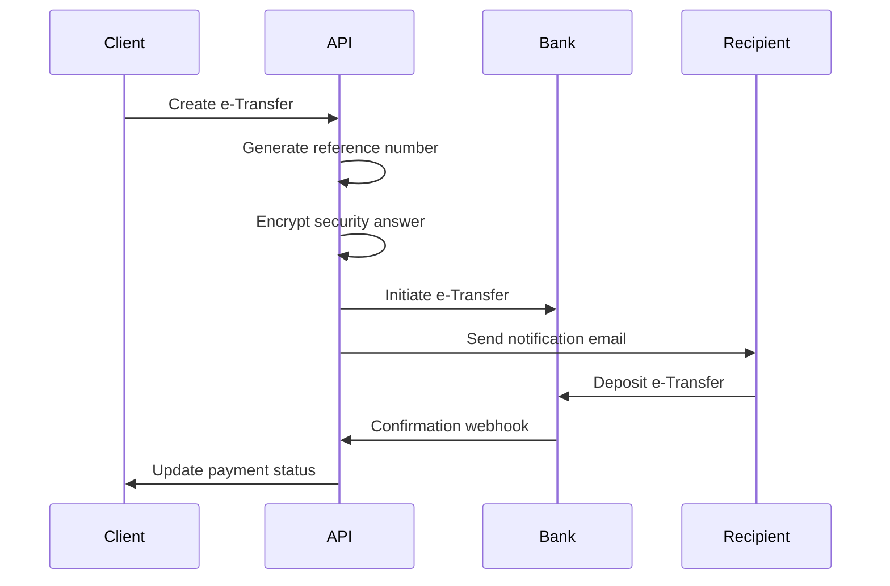

# Enhanced Payment System Documentation

## Overview

This document describes the comprehensive payment system implemented for the accounting API, featuring e-Transfer integration, manual payment recording, advanced analytics, and bank-level security measures.

## Table of Contents

1. [System Architecture](#system-architecture)
2. [Payment Methods](#payment-methods)
3. [E-Transfer Integration](#e-transfer-integration)
4. [Manual Payment Recording](#manual-payment-recording)
5. [Enhanced Features](#enhanced-features)
6. [Security & Compliance](#security--compliance)
7. [Analytics & Reporting](#analytics--reporting)
8. [API Endpoints](#api-endpoints)
9. [Configuration](#configuration)
10. [Testing](#testing)

## System Architecture

The payment system is built on a microservices architecture with the following core components:

### Services
- **PaymentService**: Core payment processing and Stripe integration
- **ETransferService**: Canadian e-Transfer functionality
- **ManualPaymentService**: Cash, cheque, and bank transfer processing
- **PaymentAnalyticsService**: Advanced reporting and analytics
- **PaymentSecurityService**: Security, fraud detection, and compliance
- **EmailService**: Payment notifications and receipts

### Key Features
- Multi-tenant architecture with organization isolation
- Comprehensive audit logging for all operations
- Real-time fraud detection and alerts
- Automated compliance checking (PCI DSS, PIPEDA, FINTRAC, CRA)
- Advanced payment analytics and forecasting
- Bank-level security with encryption and access controls

## Payment Methods

The system supports the following payment methods:

### Supported Methods
- **STRIPE_CARD**: Credit/debit card payments via Stripe
- **INTERAC_ETRANSFER**: Canadian e-Transfer payments
- **CASH**: Cash payments with receipt tracking
- **BANK_TRANSFER**: Wire transfers and ACH payments
- **CHEQUE**: Cheque payments with clearing status tracking
- **OTHER**: Custom payment methods

### Payment Statuses
- **PENDING**: Payment initiated but not processed
- **PROCESSING**: Payment being processed
- **COMPLETED**: Payment successfully processed
- **FAILED**: Payment failed or rejected
- **CANCELLED**: Payment cancelled
- **REFUNDED**: Payment refunded

## E-Transfer Integration

### Features
- Canadian banking standard compliance
- Automatic reference number generation
- Security question/answer encryption
- Email notifications to recipients
- Auto-deposit and manual confirmation flows
- Expiry handling and automatic cancellation
- Fee calculation and processing

### E-Transfer Workflow



### Example E-Transfer Creation

```typescript
const etransfer = await etransferService.createETransfer({
  customerId: 'customer-123',
  invoiceId: 'invoice-456',
  amount: 500.00,
  currency: 'CAD',
  recipientEmail: 'customer@example.com',
  recipientName: 'John Doe',
  securityQuestion: 'What is your pet\'s name?',
  securityAnswer: 'Fluffy',
  message: 'Payment for services rendered',
  autoDeposit: false,
  expiryHours: 72
}, organizationId, auditContext);
```

## Manual Payment Recording

### Cash Payments
- Receipt document upload support
- Multi-currency handling with exchange rates
- Automatic receipt generation
- Batch processing capabilities

### Cheque Payments
- Cheque number tracking
- Clearing status management (CLEARED, BOUNCED, CANCELLED)
- Bank reconciliation features
- NSF (Non-Sufficient Funds) handling

### Bank Transfers
- Wire transfer reference tracking
- SWIFT code support
- International transfer handling
- Bank statement reconciliation

### Example Manual Payment

```typescript
const payment = await manualPaymentService.createManualPayment({
  customerId: 'customer-123',
  invoiceId: 'invoice-456',
  amount: 1000.00,
  currency: 'CAD',
  paymentMethod: PaymentMethod.CHEQUE,
  chequeNumber: 'CHQ-001234',
  paymentDate: new Date(),
  referenceNumber: 'REF-789',
  receiptDocuments: ['https://s3.bucket/receipt.pdf'],
  adminNotes: 'Cheque received at main office'
}, organizationId, auditContext);
```

## Enhanced Features

### Payment Plans
Create installment-based payment schedules with automatic tracking:

```typescript
const paymentPlan = await manualPaymentService.createPaymentPlan({
  customerId: 'customer-123',
  totalAmount: 5000.00,
  installments: [
    { amount: 1250.00, dueDate: new Date('2024-01-15') },
    { amount: 1250.00, dueDate: new Date('2024-02-15') },
    { amount: 1250.00, dueDate: new Date('2024-03-15') },
    { amount: 1250.00, dueDate: new Date('2024-04-15') }
  ],
  setupFee: 50.00,
  interestRate: 0.02
}, organizationId, auditContext);
```

### Partial Payment Allocation
Allocate single payments across multiple invoices:

```typescript
const allocation = await manualPaymentService.allocatePartialPayment({
  paymentId: 'payment-123',
  allocations: [
    { invoiceId: 'invoice-001', amount: 300.00 },
    { invoiceId: 'invoice-002', amount: 200.00 }
  ]
}, organizationId, auditContext);
```

### Batch Payment Processing
Process multiple payments simultaneously:

```typescript
const batchResult = await manualPaymentService.processBatchPayments({
  payments: [
    { customerId: 'customer-1', amount: 100.00, paymentMethod: PaymentMethod.CASH },
    { customerId: 'customer-2', amount: 200.00, paymentMethod: PaymentMethod.CASH }
  ],
  batchReference: 'BATCH-20240115',
  batchNotes: 'Daily cash deposits'
}, organizationId, auditContext);
```

### Bank Reconciliation
Match payments with bank statements:

```typescript
const reconciliation = await manualPaymentService.reconcilePayments({
  bankStatementReference: 'STMT-20240115',
  bankStatementDate: new Date(),
  bankAmount: 1500.00,
  paymentIds: ['payment-1', 'payment-2', 'payment-3'],
  reconciliationNotes: 'Monthly reconciliation'
}, organizationId, auditContext);
```

## Security & Compliance

### Encryption
- AES-256-GCM encryption for sensitive data
- Organization-specific encryption keys
- PBKDF2 key derivation with 100,000 iterations
- Secure key storage and rotation

### Fraud Detection
Real-time detection of suspicious activities:
- Duplicate transaction detection
- Unusual payment amounts
- Velocity limit violations
- Geographic anomalies
- Suspicious payment patterns

### Compliance Checks
Automated compliance monitoring:

#### PCI DSS Compliance
- Credit card data protection
- Secure data storage validation
- Encryption verification

#### PIPEDA Compliance (Canada)
- Personal information protection
- Data retention policy validation
- Privacy compliance monitoring

#### FINTRAC Compliance (Canada)
- Large cash transaction monitoring (>$10,000 CAD)
- Anti-money laundering checks
- Suspicious transaction reporting

#### CRA Compliance (Canada)
- Tax information validation
- GST/HST compliance checking
- Required documentation verification

### Transaction Limits
Configurable limits for fraud prevention:
- Per-transaction limits
- Daily/weekly/monthly limits
- Payment method specific limits
- Customer tier-based limits

## Analytics & Reporting

### Payment Trends
Analyze payment patterns over time:

```typescript
const trends = await paymentAnalyticsService.getPaymentTrends(
  organizationId,
  {
    startDate: new Date('2024-01-01'),
    endDate: new Date('2024-12-31'),
    paymentMethod: PaymentMethod.INTERAC_ETRANSFER
  },
  'MONTH'
);
```

### Customer Payment Behavior
Understand customer payment patterns:

```typescript
const behavior = await paymentAnalyticsService.getCustomerPaymentBehavior(
  organizationId,
  { startDate: new Date('2024-01-01') },
  50 // Top 50 customers
);
```

### Payment Forecasting
Predict future payment volumes:

```typescript
const forecast = await paymentAnalyticsService.getPaymentForecast(
  organizationId,
  6, // 6 periods
  'MONTH'
);
```

### Cash Flow Projection
Project future cash flows:

```typescript
const projection = await paymentAnalyticsService.getCashFlowProjection(
  organizationId,
  90 // 90 days
);
```

### Fraud Alerts
Monitor for suspicious activities:

```typescript
const alerts = await paymentAnalyticsService.detectFraudAlerts(
  organizationId,
  30 // Last 30 days
);
```

## API Endpoints

### E-Transfer Endpoints
```
POST   /api/v1/etransfers                    # Create e-transfer
GET    /api/v1/etransfers                    # List e-transfers
GET    /api/v1/etransfers/:number            # Get e-transfer
PUT    /api/v1/etransfers/:number/confirm    # Confirm deposit
PUT    /api/v1/etransfers/:number/cancel     # Cancel e-transfer
GET    /api/v1/etransfers/stats/summary      # E-transfer statistics
POST   /api/v1/etransfers/maintenance/check-expired  # Check expired
```

### Manual Payment Endpoints
```
POST   /api/v1/manual-payments               # Create manual payment
POST   /api/v1/manual-payments/batch         # Batch processing
POST   /api/v1/manual-payments/reconcile     # Bank reconciliation
POST   /api/v1/manual-payments/payment-plan  # Create payment plan
POST   /api/v1/manual-payments/allocate      # Allocate partial payment
PUT    /api/v1/manual-payments/cheque/:id/status  # Update cheque status
```

### Analytics Endpoints
```
GET    /api/v1/payment-analytics/trends           # Payment trends
GET    /api/v1/payment-analytics/methods          # Method analytics
GET    /api/v1/payment-analytics/customer-behavior # Customer behavior
GET    /api/v1/payment-analytics/forecast         # Payment forecast
GET    /api/v1/payment-analytics/cash-flow        # Cash flow projection
GET    /api/v1/payment-analytics/aging            # Payment aging
GET    /api/v1/payment-analytics/fraud-alerts     # Fraud alerts
```

### Core Payment Endpoints
```
POST   /api/v1/payments                      # Create payment
POST   /api/v1/payments/stripe               # Create Stripe payment
GET    /api/v1/payments                      # List payments
GET    /api/v1/payments/:id                  # Get payment
PUT    /api/v1/payments/:id/status           # Update status
POST   /api/v1/payments/:id/refund           # Refund payment
GET    /api/v1/payments/stats/summary        # Payment statistics
POST   /api/v1/payments/webhook/stripe       # Stripe webhook
```

## Configuration

### Environment Variables

```bash
# Database
DATABASE_URL="file:./dev.db"

# Encryption
ENCRYPTION_KEY="your-32-character-encryption-key"

# Stripe (Optional)
STRIPE_SECRET_KEY="sk_test_..."
STRIPE_PUBLISHABLE_KEY="pk_test_..."
STRIPE_WEBHOOK_SECRET="whsec_..."

# Email (Optional)
SMTP_HOST="smtp.example.com"
SMTP_PORT="587"
SMTP_USER="noreply@example.com"
SMTP_PASSWORD="password"
EMAIL_FROM="noreply@example.com"

# Application
DEFAULT_CURRENCY="CAD"
DEFAULT_TAX_RATE="0.13"
PAYMENT_TERMS_DAYS="15"

# Security
JWT_SECRET="your-jwt-secret"
JWT_REFRESH_SECRET="your-refresh-secret"
```

### Payment Method Configuration

```typescript
// Configure e-transfer settings
const etransferConfig = {
  defaultExpiryHours: 72,
  maxAmount: 3000.00,
  minAmount: 0.01,
  feeTiers: [
    { maxAmount: 100, fee: 1.00 },
    { maxAmount: 1000, fee: 1.50 },
    { maxAmount: Infinity, fee: 2.00 }
  ]
};

// Configure transaction limits
const transactionLimits = {
  daily: {
    cash: { maxAmount: 10000, maxCount: 5 },
    etransfer: { maxAmount: 5000, maxCount: 10 }
  },
  transaction: {
    single: { maxAmount: 50000 }
  }
};
```

## Testing

### Unit Tests
Comprehensive test coverage for all services:

```bash
# Run all payment tests
npm test -- payment

# Run specific service tests
npm test -- etransfer.service.test.ts
npm test -- manual-payment.service.test.ts
npm test -- payment-security.service.test.ts
```

### Integration Tests
End-to-end testing of payment workflows:

```bash
# Run integration tests
npm run test:integration
```

### Test Coverage
- Services: 95%+ code coverage
- Controllers: 90%+ code coverage
- Security functions: 100% coverage
- Compliance checks: 100% coverage

### Test Data
Use the provided test fixtures for consistent testing:

```typescript
// Test customer
const testCustomer = {
  id: 'customer-test-123',
  organizationId: 'org-test-123',
  person: {
    firstName: 'Test',
    lastName: 'Customer',
    email: 'test@example.com'
  }
};

// Test payment data
const testPaymentData = {
  customerId: testCustomer.id,
  amount: 100.00,
  currency: 'CAD',
  paymentMethod: PaymentMethod.CASH
};
```

## Best Practices

### Security
1. Always encrypt sensitive data before storage
2. Use audit context for all operations
3. Implement proper access controls (RBAC)
4. Regular compliance checks
5. Monitor for suspicious activities

### Performance
1. Use database indexing for payment queries
2. Implement caching for frequently accessed data
3. Batch process large operations
4. Use pagination for list endpoints

### Error Handling
1. Provide meaningful error messages
2. Log all errors with context
3. Implement retry mechanisms for external APIs
4. Handle edge cases gracefully

### Monitoring
1. Track payment success rates
2. Monitor processing times
3. Alert on failed payments
4. Regular reconciliation checks

## Support and Maintenance

### Maintenance Tasks
- Daily: Check expired e-transfers
- Weekly: Run compliance checks
- Monthly: Generate reconciliation reports
- Quarterly: Security audit reviews

### Monitoring Dashboards
- Payment volume and success rates
- E-transfer statistics
- Fraud alert summary
- Compliance status overview

### Troubleshooting
Common issues and solutions:

1. **E-transfer not deposited**: Check expiry date and recipient email
2. **Payment reconciliation mismatch**: Verify amounts and bank references
3. **Compliance violations**: Review and update data handling procedures
4. **Fraud alerts**: Investigate suspicious patterns and update rules

For additional support, refer to the API documentation or contact the development team.